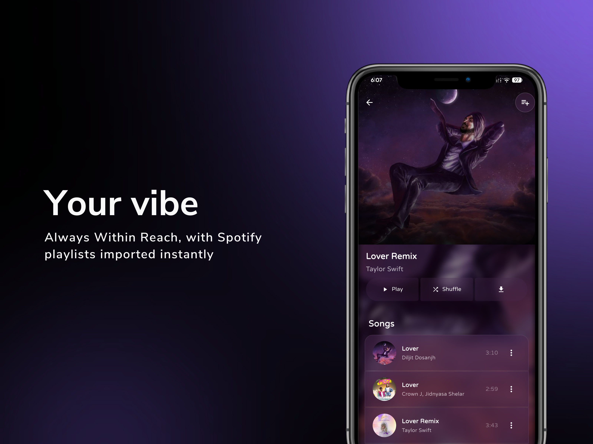
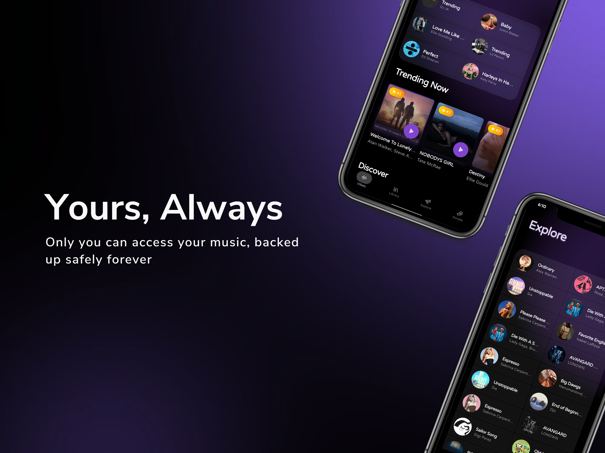

  

# 🎵 Liri

### Your music, your way—beautifully organized

**A modern music management experience designed for seamless listening, organizing, and importing**

---

### 📸 Experience Liri

<table>
  <tr>
    <td></td>
    <td></td>
    <td></td>
    <td></td>
  </tr>
  <tr>
    <td></td>
    <td></td>
    <td></td>
    <td></td>
  </tr>
</table>

---

## 🌟 What Makes Liri Special

<table>
<tr>
<td width="33%" valign="top">

### 🎧 **Offline First**
Enjoy your entire music library anytime, anywhere—even when you're completely offline. Your music travels with you.

</td>
<td width="33%" valign="top">

### 🎼 **Spotify Integration**
Seamlessly import your playlists, liked songs, and albums from Spotify. Keep all your favorites in one unified place.

</td>
<td width="33%" valign="top">

### 🎨 **Modern Design**
Built with Material 3 principles—beautiful, expressive, and adaptive interface that feels natural and delightful.

</td>
</tr>
<tr>
<td width="33%" valign="top">

### 📂 **Smart Playlists**
Create, edit, and organize playlists with intelligent management tools. Your music, your way.

</td>
<td width="33%" valign="top">

### ⚡ **Lightning Fast**
Powerful search capabilities let you find any song, artist, or album instantly. No waiting around.

</td>
<td width="33%" valign="top">

### 🔒 **Privacy Focused**
Your data stays on your device. No tracking, no cloud storage, no compromises. Your music is yours alone.

</td>
</tr>
</table>

---

## 🚀 Why Choose Liri?

> **A music player that respects you and your music**

- ✅ **No Internet Required** – Playback works completely offline after initial sync
- ✅ **Import Freedom** – Bring your music from Spotify and other sources
- ✅ **Lightweight & Fast** – Optimized performance that doesn't slow you down
- ✅ **Zero Ads** – No advertisements, no interruptions, ever
- ✅ **No Tracking** – Your listening habits are private
- ✅ **Open Source** – Community-driven development you can trust
- ✅ **Cross-Platform** – Available on Windows, macOS, and Linux

---

## 🛠️ Built With Modern Technology

| Technology | Purpose | Why We Use It |
|:---:|:---:|:---:|
| **Electron** | Desktop Framework | Cross-platform native experience |
| **React** | UI Library | Fast, reactive user interface |
| **Redux** | State Management | Predictable app state |
| **Spotify Web API** | Integration | Seamless Spotify imports |
| **Dexie.js** | Offline Storage | IndexedDB wrapper for performance |
| **Styled Components** | Styling | Dynamic, component-scoped styles |
| **Howler.js** | Audio Playback | Reliable cross-browser audio |

---

## 🔐 Security & Privacy Promise

At Liri, we believe your music and data belong to you—and only you.

- 🔒 **Local Storage Only** – All data stays on your device
- 🔒 **No Analytics** – We don't track what you listen to
- 🔒 **Secure by Design** – No unnecessary permissions or data collection
- 🔒 **Open Source** – Audit our code anytime you want

*Your API keys, encryption methods, and database structures are never exposed or stored insecurely.*

---

## 🤝 Contributing

Liri is open source and we welcome contributions! Whether it's:

- 🐛 Bug reports
- 💡 Feature requests
- 📝 Documentation improvements
- 🎨 UI/UX enhancements
- 💻 Code contributions

Check out our [Contributing Guide](CONTRIBUTING.md) to get started.

---

## 📄 License

Liri is released under the **MIT License**. See [LICENSE](LICENSE) for details.

---

### Made with ❤️ by the Liri Community

**[Website](https://liri.app)** • **[Documentation](https://docs.liri.app)** • **[Discord](https://discord.gg/liri)** • **[Twitter](https://twitter.com/liriapp)**

⭐ **If you enjoy Liri, give us a star on GitHub!** ⭐

